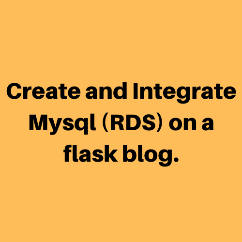
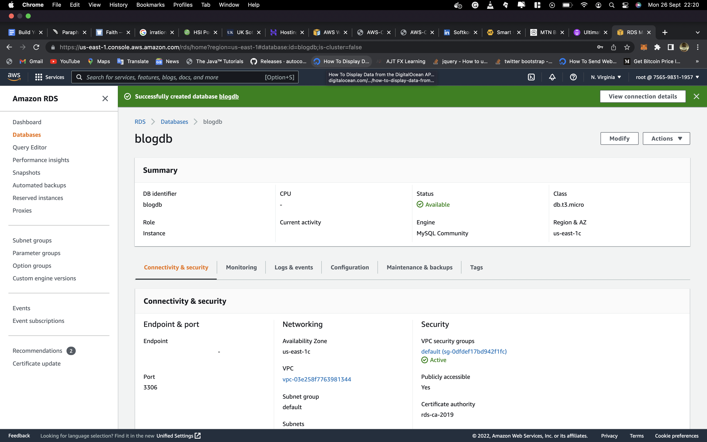

Day 001
===

Starting out today, i decided to learn about database in aws. I learnt about  Amazon Web Services relational database service, which is a managed relational database service, which offers you a choice of six well-known database engines, including Microsoft SQL Server, Amazon Aurora, MySQL, MariaDB, PostgreSQL, and MariaDB.

Next was DynamoDB which is an Amazon Web Services database system that supports data structures and key-valued cloud service. It allows users the benefit of auto-scaling, in-memory caching, backup and restore options for all their internet-scale applications using DynamoDB

I interestingly found out s3 could also be a database service. AWS S3 used as a database service is a key-value store, one of the major categories of NoSQL databases used for accumulating voluminous, mutating, unstructured, or semi-structured data. Uploaded objects are referenced by a unique key, which can be any string

Yet another was Amazon Neptune which is a fast, reliable, fully managed graph database service that makes it easy to build and run applications that work with highly connected datasets.

I also learnt about ElastiCache for caching, which accelerates application and database performance, or as a primary data store for use cases that don't require durability like session stores, gaming leaderboards etc. 

There where some other databases and database concept i looked at, but at the end i decided to work with the MYSQL RDS on a flask blog application that formerly used sqlite database service for my hands On. I wanted to take it a-bit further but encounter some bugs in getting secret manager to work. I will surely give it a try again tomorrow.

Overview of RDS configuration: 

## Outstanding Challenges
Using secret manager to manage the database password
