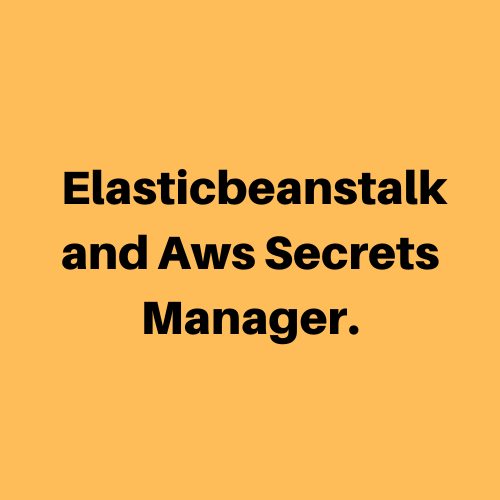

Day 002
===

Day two of my journey began with the unfinished business from the day before. After some tinkering with the code, I discovered that I needed to convert the string response to json and also specify the AWS profile that it would use.

Next, I probed working with elasticbeanstalk, a simple service for deploying and scaling web applications and services. I was able to deploy an old project endpoint built with django-rest-framework (Python) and connect it to a postgres database service by following an aws guide (https://docs.aws.amazon.com/elasticbeanstalk/latest/dg/create-deploy-python-django.html).

##Overview of the elasticbeanstalk: 

##Overview of the postgres db: 

##Clean Up
I deleted the mysql database from yesterday, as well as the elasticbeanstalk application, which terminated all of the resources that it was using, such as EC2, Elb, PostgreSQL, and so on.

## Outstanding Challenges
None
