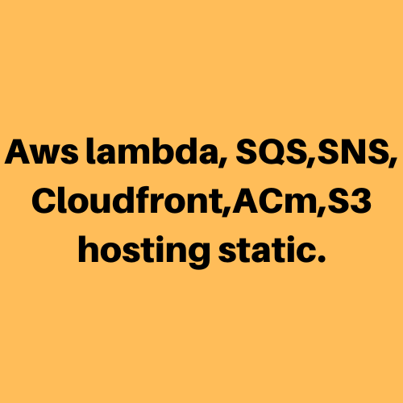
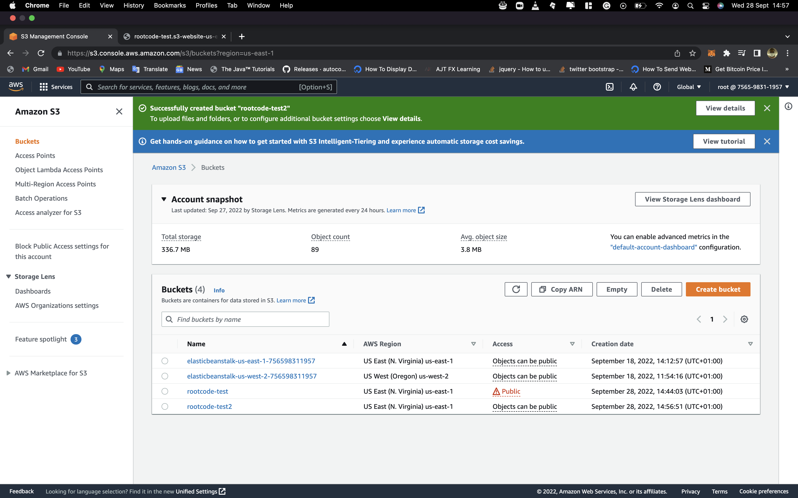
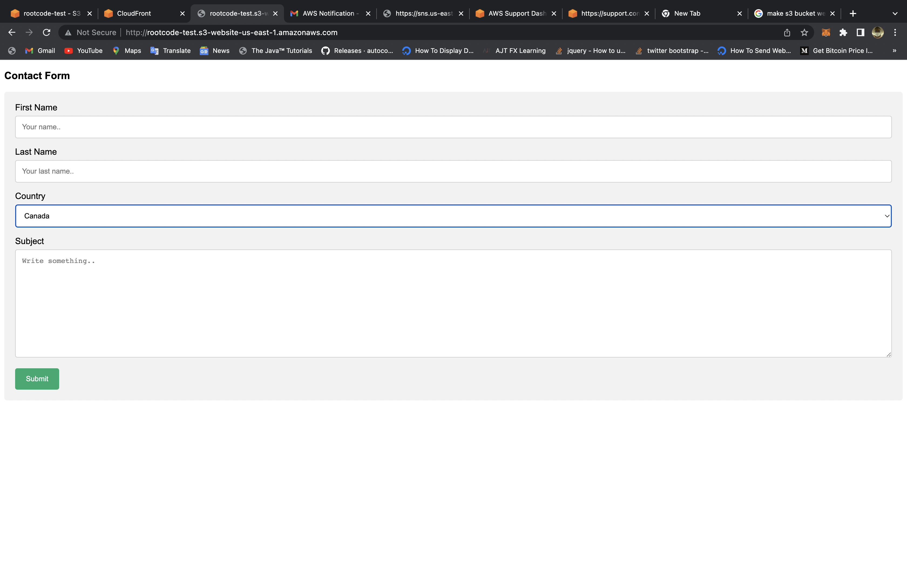
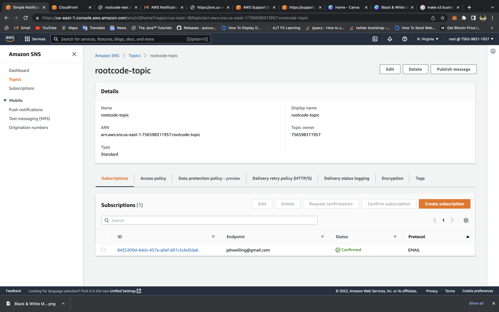
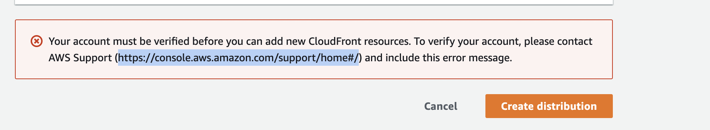

Day 002
===

Third day I learned a lot about aws lambda, which allows you to add custom logic to AWS resources like Amazon S3 buckets and Amazon DynamoDB tables, allowing you to easily compute data as it enters or moves through the cloud. Lambda runs your code on a high-availability compute infrastructure and handles all compute resource administration, such as server and operating system maintenance, capacity provisioning and automatic scaling, and logging.

S3 storage a public cloud storage resource available in Amazon Web Services' (AWS) Simple Storage Service (S3), an object storage offering was something cover today. SQS, a fully managed message queuing service, came next, allowing you to decouple and scale microservices, distributed systems, and serverless applications. I then moved on to sns, a fully managed messaging service that supports both application-to-application (A2A) and application-to-person (A2P) communication.

After that, I decided to work on a small serverless application because I had interacted with a lot of services. I created a form that will send form data to lambda via api gateway, where it will be inserted into dynamodb and also distributed via SNS. So far, I've created and hosted the static form on S3, created an SNS topic, and am currently working on cloud front.

##Overview of the host S3 site: 

##Overview of the SNs topic: 

## Outstanding Challenges
Cloud front creation blocked by aws

