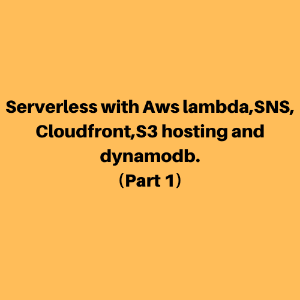
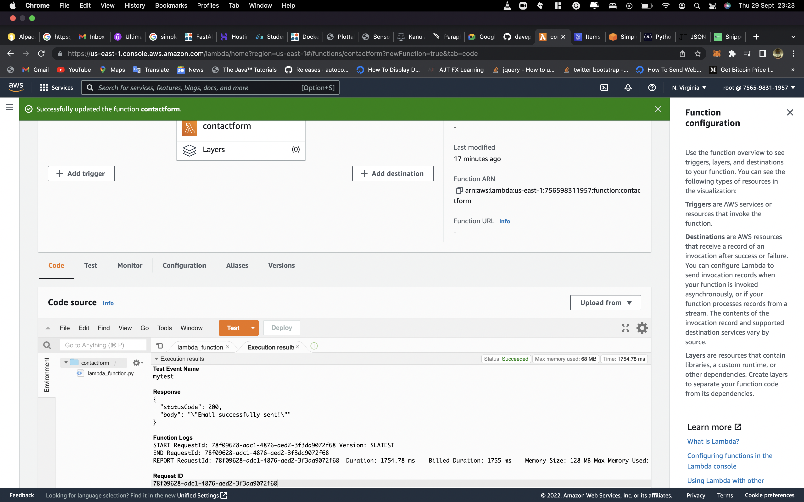
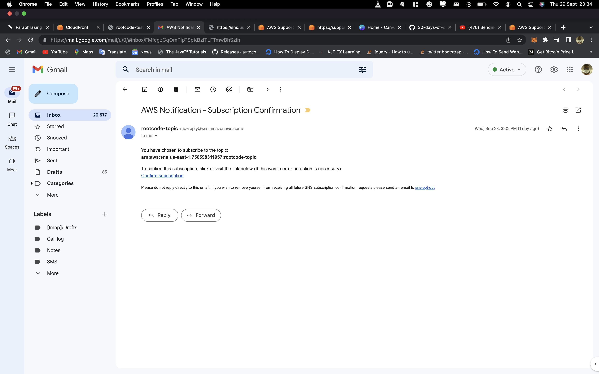
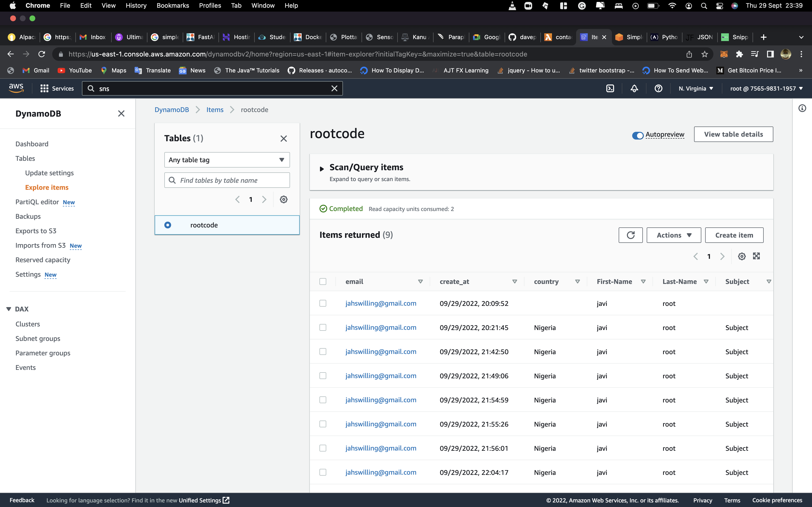

Day 004
===

I kept working on the serverless application on day 4. The work was more or less in hand on a lambda function (mail_lambda.py file) that publishes the SNS topic we had previously built and inserts the data into the dynamo database we had created yesterday. The lambda was completed today remaining the next/last steps which involve connecting it to API gate-way and integrating on the index.html page.

##Overview of the lambda function test: 

## Outstanding Challenges
Cloud front creation blocked by aws

