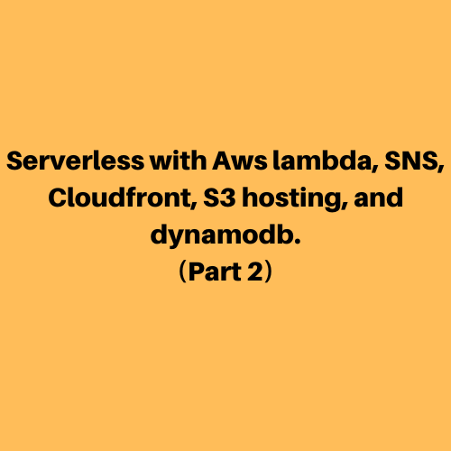
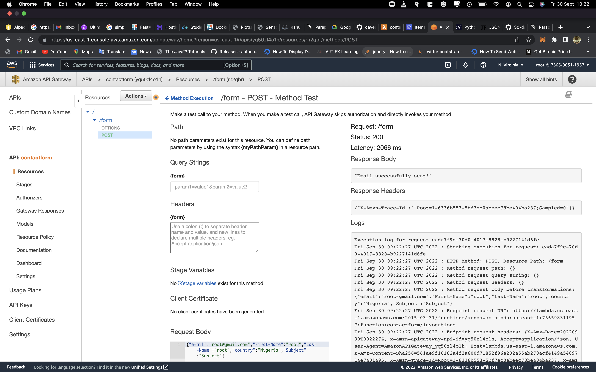
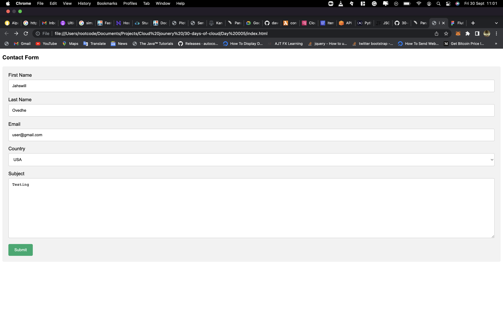
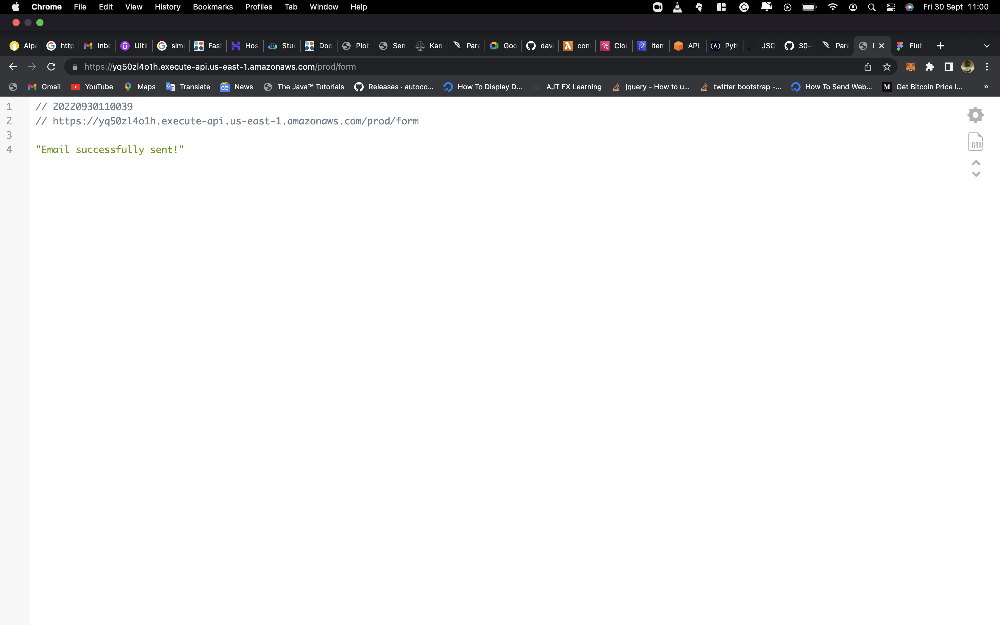
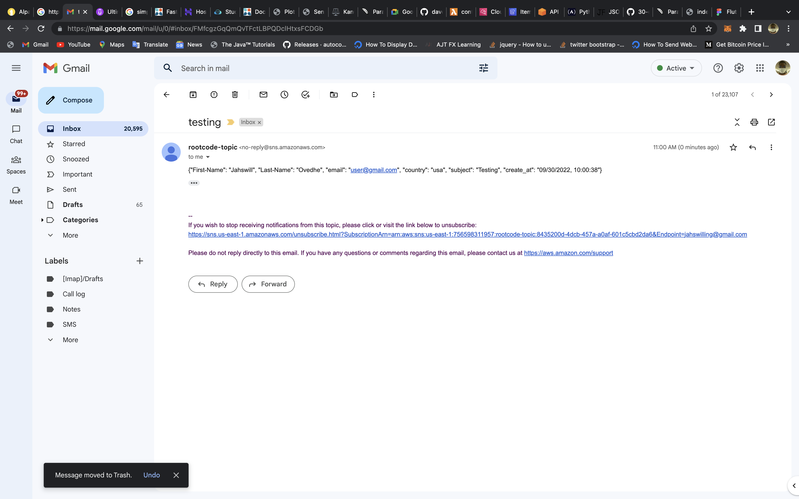

Day 004
===

I kept working on the serverless application on day 5. I completed the last part of the steps which involve connecting it to API gate-way and integrating on the index.html page.

##Overview of the API Gateway: 

##Overview of the Form and response: 

## Outstanding Challenges
Cloud front creation blocked by aws

