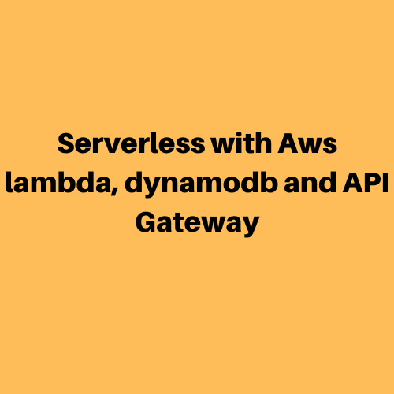
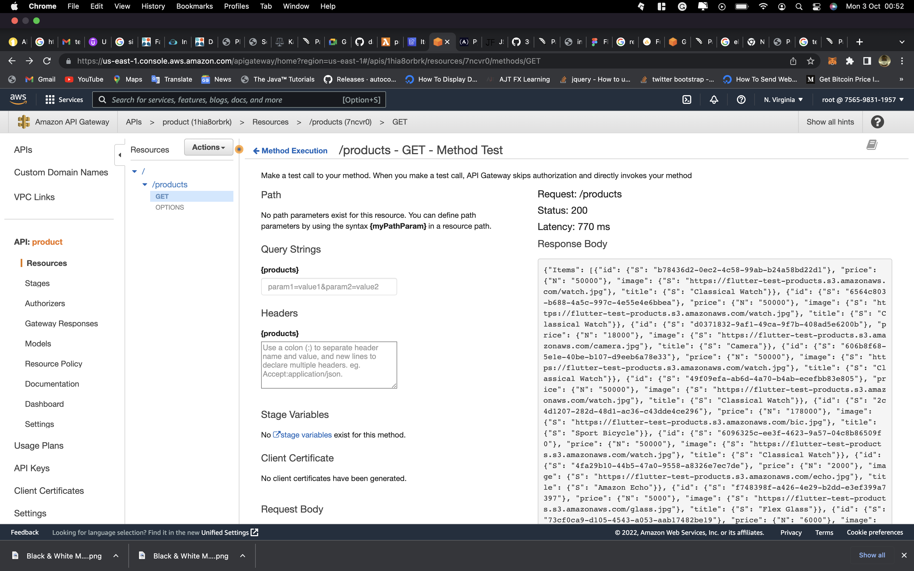
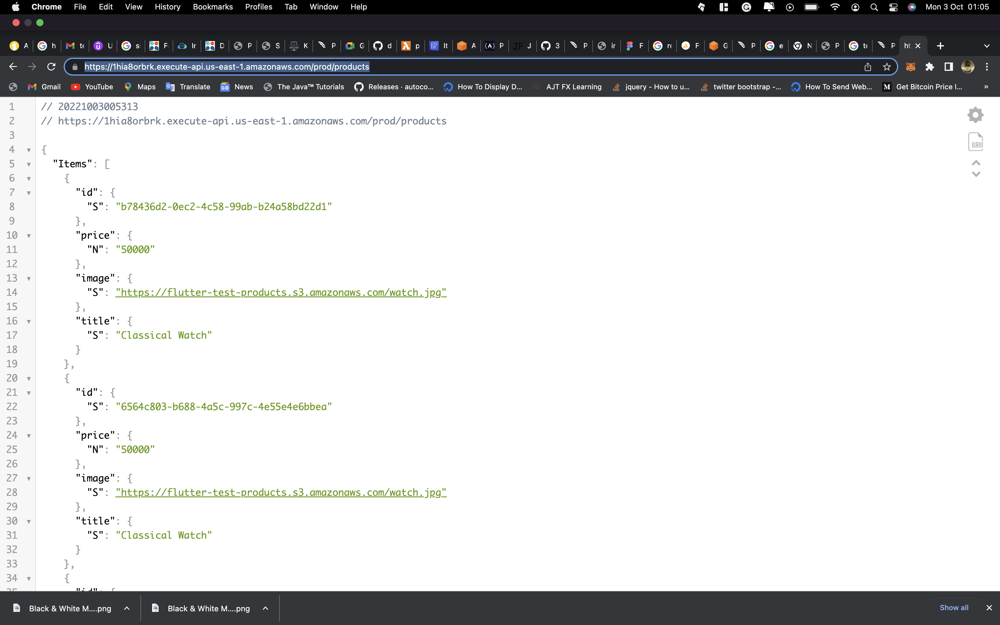
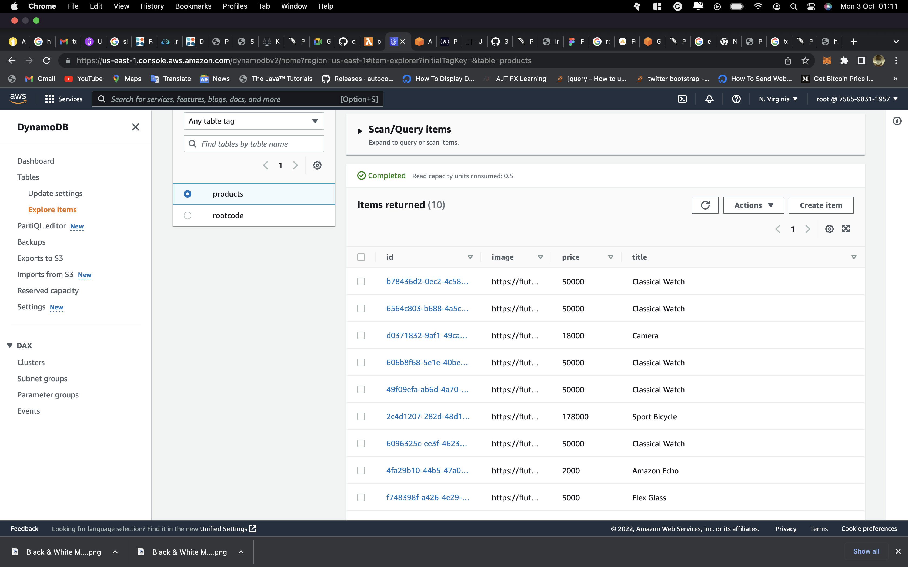
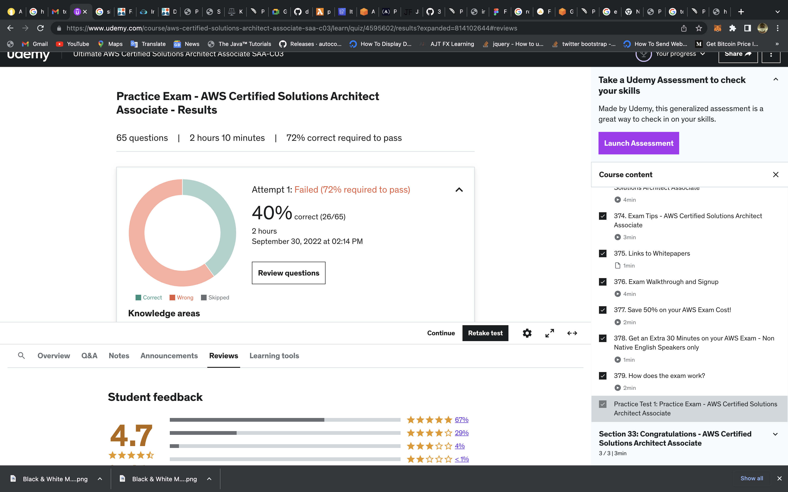

Day 006 & 007
===

On day 006, I had the opportunity to try out the serverless solution. As an engineering manager in my company, I interviewed some candidates for a position, and after the interview, we decided to put them through a technical test. This entailed retrieving data from any endpoint and displaying the results on the UI. For the endpoint, I decided to use a serverless solution. I create a get request endpoint that they can interact with for the technical test using api gateway, aws lambda, dynamodb, and s3 for storage. Here is a link to the endpoint https://1hia8orbrk.execute-api.us-east-1.amazonaws.com/prod/products

On day 007, I took an SSA practice test to test my current knowledge of AWS before retaking the course, and the result was disastrous. It's all part of the process, so I'll make a point of documenting both wins and losses. Though this defeat was a significant setback, it has better prepared me for what to expect as I read through the course material.

##Overview of the API: 

##Overview of the Data in dynamodb: 

##Overview of score in day 7: 

## Outstanding Challenges
N/A
