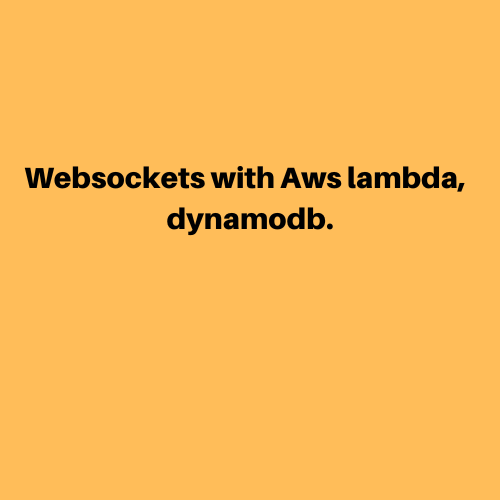
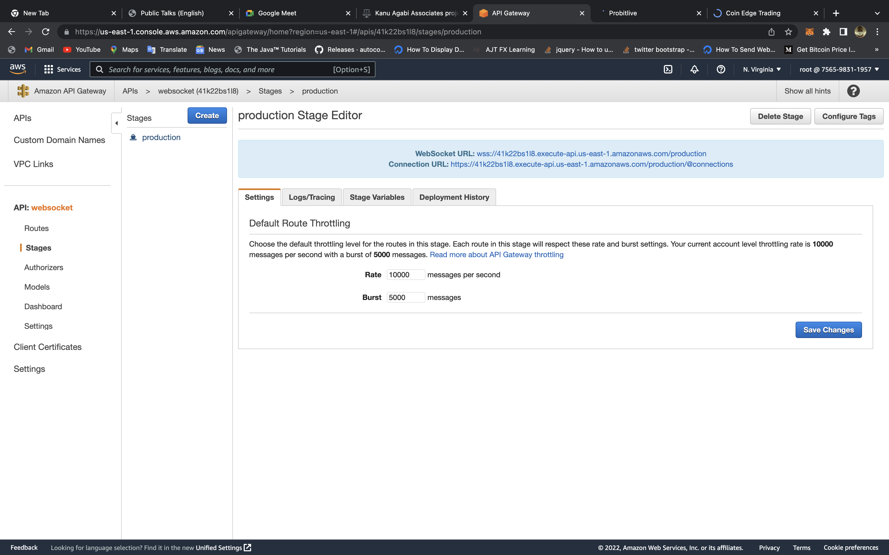
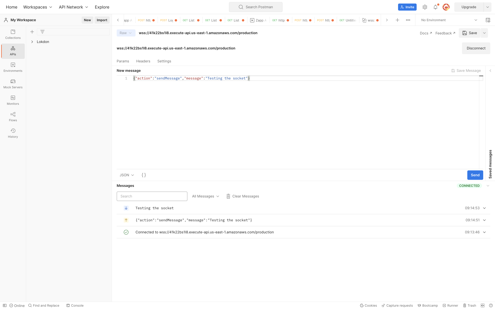
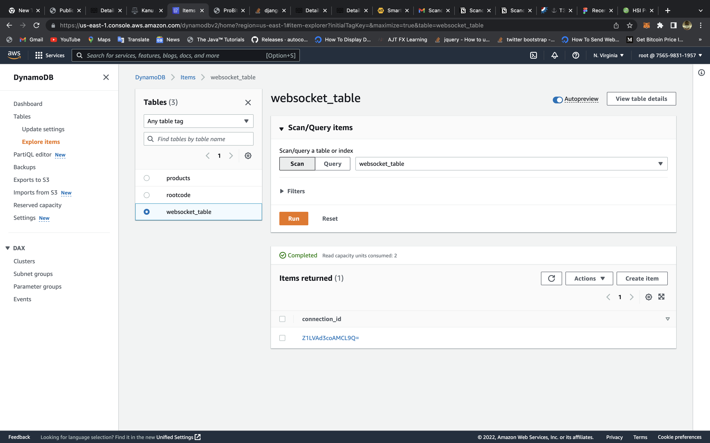

Day 008 to 010
===

On day 008, I decided to go over the SSA practice exam I took last week and do some additional reading on some of the topics covered in the practice exam. 009 and 010 I created a serverless websocket with api gateway lambda and dynamodb. It took some time to work out some bugs, but I was eventually able to fix them.

##Overview of the API: 

##Overview of the Data in dynamodb: 

## Outstanding Challenges
N/A
